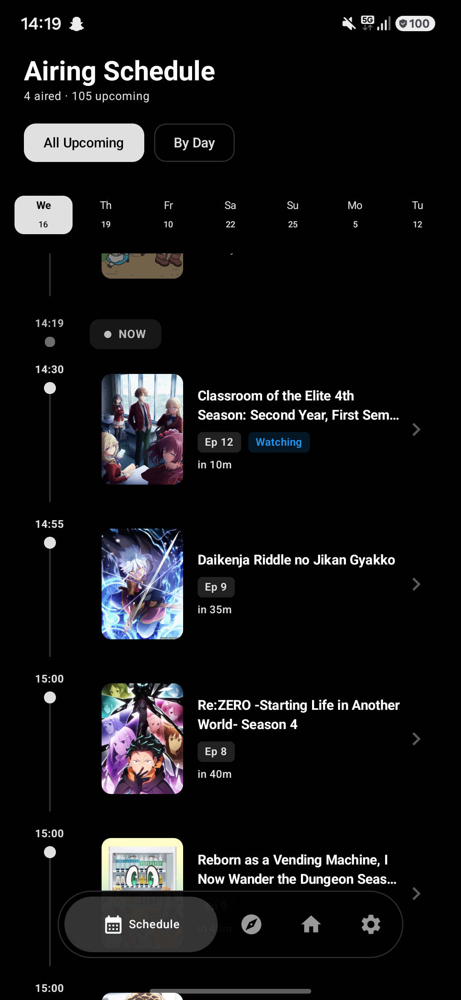
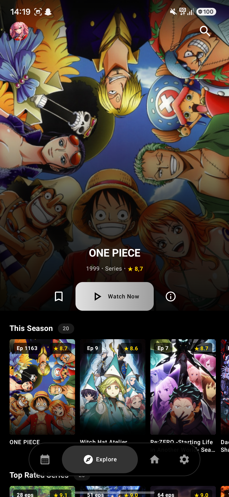
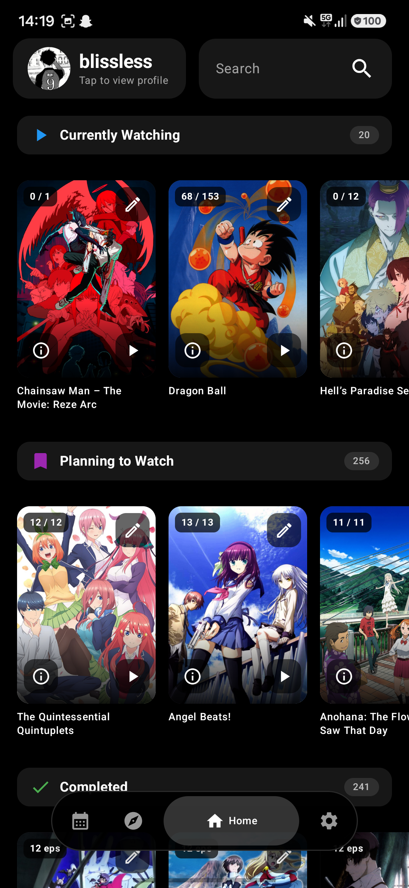
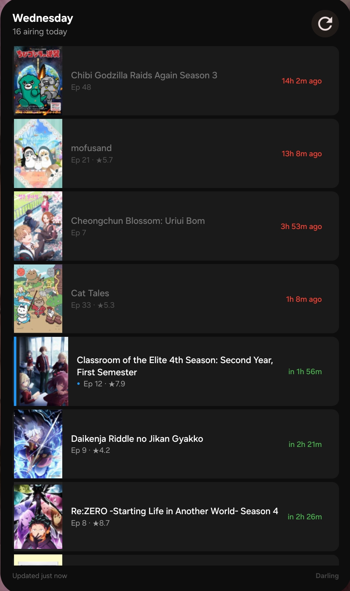

# Tensei

> Previously known as **Darling** — rebranded and rebuilt.

A modern anime tracking and streaming app for Android.

## Screenshots

| Schedule | Explore | Home | Widget |
|----------|---------|------|--------|
|  |  |  |  |

## Features

- **AniList and MyAnimeList Integration** - Login to sync your anime list
- **Streaming** - Watch anime with built-in player (ExoPlayer)
- **Extension Streaming** - Dynamically load extension APKs to stream from multiple sources using the Tachiyomi anime source framework
- **Progress Tracking** - Automatically sync watch progress
- **Explore** - Browse trending, seasonal, and top-rated anime
- **Video Player** - Opening and ending skip buttons, quality selection, resize button

## Requirements

- Android 8.0+ (API 26+)

## Installation

Download the APK from [Releases](https://github.com/YOUR_USERNAME/tensei/releases) and install.

## Tech Stack

- **Kotlin + Jetpack Compose** - UI framework
- **Media3 ExoPlayer** - Video playback
- **AniList GraphQL API** - Anime list syncing, metadata, user data
- **TMDB API** - Episode metadata (titles, descriptions, thumbnails) for library and streaming views
- **Jikan API (v4)** - MyAnimeList favorites and history sync for MAL users
- **Aniyomi Anime Source Framework** - Dynamic extension system for multi-source streaming
- **MVVM Architecture** - ViewModel + StateFlow pattern
- **OkHttp + kotlinx.serialization** - HTTP client and JSON parsing for third-party APIs
- **Coil** - Image loading and caching

## Forking the repository

`local.properties` file with the following keys needed:

CLIENT_ID_ANILIST  
TMDB_API_KEY  
MAL_CLIENT_ID  

## Disclaimer

This app is for educational purposes only. I do not host, upload, or distribute any anime content. All streaming links are provided by third-party sources.
